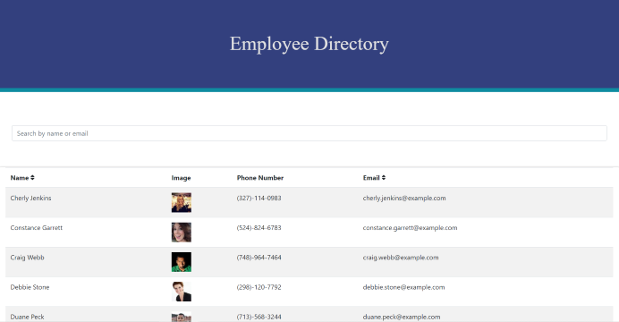

# NotAnotherDirectory

## Table of Contents
* [Description](#description)
* [Installation](#installation)
* [Usage](#usage)
* [Credits](#credits)
* [License](#license)
* [Questions](#questions)

## Description
This website is designed to emulate an employee directory using react as a framework. The page is populated using Random User Generator.

## Installation
To install this application, add this repository to a folder of your choosing. Run 'npm install axios bootstrap' in order to acquire the necessary dependencies.

## Usage
To utilize this application, run npm start in your terminal or command prompt. The simulated employees are searchable by first name, last name, and email. Similarly, the application can be run using the following link:

Deployed application: https://kayvonk.github.io/NotAnotherDirectory/

## Credits
Random User Generator is an open-source API which was utilized in this webpage. 
https://randomuser.me/

## License
This project is licensed with MIT.

## Questions
Follow me on [Github](https://github.com/Kayvonk).

To contact me, send an email to kayvonk@gmail.com with your name and inquiry.

